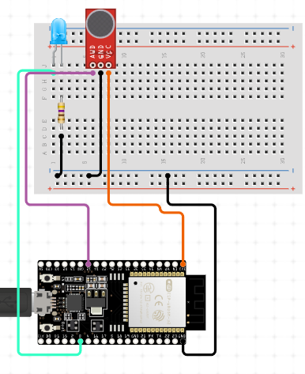

# ESP32 - Button


## Hardware Usado para la practica

  * 1 × ESP-WROOM-32 Dev Module	
  * 1 × Cable micro USB 	
  * 1 × led	
  * 1 × protoboard
  * 9 × jumpers
  * 1 x resistencia 220


### Introdución al sensor BigSound

Se trata de un sensor que detecta sonido, especialmente sonidos altos, cuenta con 4 pines y 2 indicadores led; el primero indica la entrada de energia, mientras que el segundo indica si se ha detectado un sonido. Ademas cuenta con un regulador el cual aumenta o disminuye la tolerancia al volumen del ruido el cual avtica el indicadr

  * AD = Salida Analoga
  * G = Salida a tierra 	
  * + = Entrada de energia
  * DO = Salida Digital


### Esquema de conexion




### Codigo del BigSound ArduinoIDE

  

```c++


int SOUND_PIN = 13;
 int LED_PIN = 21;

int noice = HIGH;

void setup() 
{
  pinMode(LED_PIN, OUTPUT);
  pinMode(SOUND_PIN, INPUT);
  Serial.begin(9600);
}

void loop() 
{
  noice = digitalRead(SOUND_PIN);
  if (noice == HIGH)
  {
    digitalWrite(LED_PIN, HIGH);
    Serial.print("shatup men\n");
    
  }
  else
  {
    digitalWrite(LED_PIN, LOW);
    Serial.print("Profe tiene todo la clase con el microfono apagado\n");
  }
    delay(3000);
}
```

  

