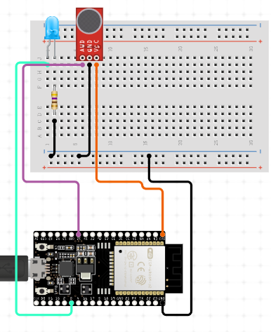

# ESP32 -PROTOTIPO  DISPENSADOR IoT DE CROQUETAS USANDO BLYNKIoT


## Hardware Usado para la practica

  * 1 × ESP-WROOM-32 Dev Module	
  * 1 × Cable micro USB 	
  * 1 x Cable USB-USB
  * 1 × protoboard
  * 3 × jumpers
  * 1 x fuente de energia
  * 1 x Servo Motor 10 kg/cm
  
  
 ## Materiales para la estructura

  * 1 × Tubo de PVC 3-6 pulgadas
  * 2 × Tapas PVC 3-6 pulgadas 	
  * 2 x Coples tapa PVC 3-6 pulgadas
  * 2 x postes de madera 30cm
  * 2 x bases de madera de 15 x 10 cm
  * 1 x base de madera 50 x 20 cm
  * 1 x soporte de madera 50 cm
  


### ¿Como funciona el dispensador?

El dispensador esta pensado como una alternativa para poder alimentar a las mascotas de manera remota por medio de la aplicación Blynk IoT, se trata de un contenedor
cilindrico echo de plastico el cual puede rotar por medio de un motor.

Una de las alternativas a los contenedores de comida que se usan actualmente (por ejemplo los implementados en la universidad) es que este dispensador mantiene la
comida cerrada sin que se contamine y el perro o gato solo tiene acceso a la porcion que se dispensa por la maquina por lo que no puede contaminar todas las croquetas
del contenedor.

Para disepensar la comida el usuario presiona el boton por medio de blynk lo que activa una rotacion del dispensador que libera una porcion de croquetas.


### Esquema de conexion




### Codigo del BigSound ArduinoIDE

  El siguiente codigo conecta con el template creado en blynk y realiza la rotacion de el servomotor cuando se presiona el boton de encendio y apagado
  
  En esta parte se debe sustituir por las credenciales de su propio template
 ```c++ 
 // See the Device Info tab, or Template settings
#define BLYNK_TEMPLATE_ID           "TMPLaRmduE3S"
#define BLYNK_DEVICE_NAME           "Quickstart Device"
#define BLYNK_AUTH_TOKEN            "9uGEo9qtiGXE-Dds9XQGqOfqFZKnmXoD"
  ```
  
  En esta parte se debe especificar la red y contraseña a la que se conectara el esp32
  
   ```c++ 
   // Your WiFi credentials.
// Set password to "" for open networks.
char ssid[] = "IZZINET-2148";
char pass[] = "734FF4DA57";
  ```

```c++


/*************************************************************

  This is a simple demo of sending and receiving some data.
  Be sure to check out other examples!
 *************************************************************/
#include <ESP32Servo.h>
// Template ID, Device Name and Auth Token are provided by the Blynk.Cloud
// See the Device Info tab, or Template settings
#define BLYNK_TEMPLATE_ID           "TMPLaRmduE3S"
#define BLYNK_DEVICE_NAME           "Quickstart Device"
#define BLYNK_AUTH_TOKEN            "9uGEo9qtiGXE-Dds9XQGqOfqFZKnmXoD"


// Comment this out to disable prints and save space
#define BLYNK_PRINT Serial


#include <WiFi.h>
#include <WiFiClient.h>
#include <BlynkSimpleEsp32.h>

char auth[] = BLYNK_AUTH_TOKEN;

#define SERVO_PIN 21// ESP32 pin GIOP26 connected to servo motor
Servo servo;

// Your WiFi credentials.
// Set password to "" for open networks.
char ssid[] = "IZZINET-2148";
char pass[] = "734FF4DA57";

BlynkTimer timer;

// This function is called every time the Virtual Pin 0 state changes
BLYNK_WRITE(V0)
{
  // Set incoming value from pin V0 to a variable
  int value = param.asInt();
if (value == 1){
   // rotates from 0 degrees to 180 degrees
  for (int pos = 0; pos <= 180; pos += 1) {
    // in steps of 1 degree
    servo.write(pos);
    delay(15); // waits 15ms to reach the position
  }

  // rotates from 180 degrees to 0 degrees
  for (int pos = 180; pos >= 0; pos -= 1) {
    servo.write(pos);
    delay(15); // waits 15ms to reach the position
  }
  }
  // Update state
  Blynk.virtualWrite(V1, value);
}

// This function is called every time the device is connected to the Blynk.Cloud
BLYNK_CONNECTED()
{
  // Change Web Link Button message to "Congratulations!"
  Blynk.setProperty(V3, "offImageUrl", "https://static-image.nyc3.cdn.digitaloceanspaces.com/general/fte/congratulations.png");
  Blynk.setProperty(V3, "onImageUrl",  "https://static-image.nyc3.cdn.digitaloceanspaces.com/general/fte/congratulations_pressed.png");
  Blynk.setProperty(V3, "url", "https://docs.blynk.io/en/getting-started/what-do-i-need-to-blynk/how-quickstart-device-was-made");
}

// This function sends Arduino's uptime every second to Virtual Pin 2.
void myTimerEvent()
{
  // You can send any value at any time.
  // Please don't send more that 10 values per second.
  Blynk.virtualWrite(V2, millis() / 1000);
}

void setup()
{
  // Debug console
  Serial.begin(115200);
servo.attach(SERVO_PIN);
  Blynk.begin(auth, ssid, pass);
  // You can also specify server:
  //Blynk.begin(auth, ssid, pass, "blynk.cloud", 80);
  //Blynk.begin(auth, ssid, pass, IPAddress(192,168,1,100), 8080);

  // Setup a function to be called every second
  timer.setInterval(1000L, myTimerEvent);
}

void loop()
{
  Blynk.run();
  timer.run();
  // You can inject your own code or combine it with other sketches.
  // Check other examples on how to communicate with Blynk. Remember
  // to avoid delay() function!
}
```

  
